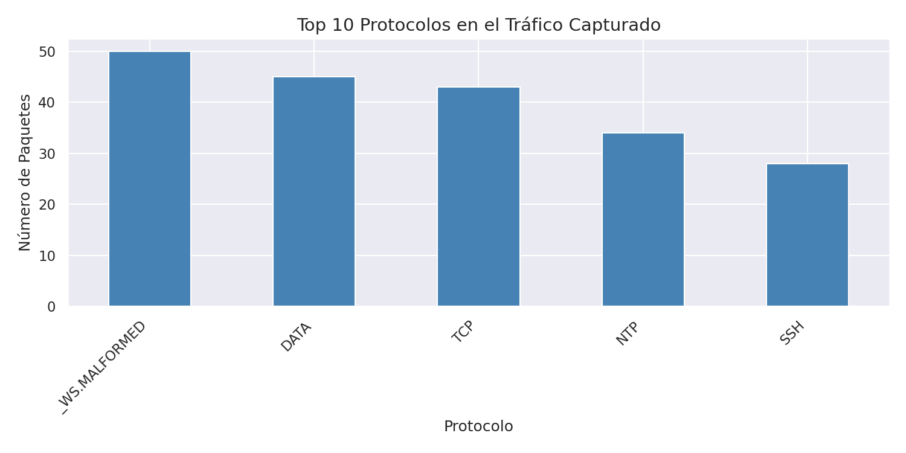
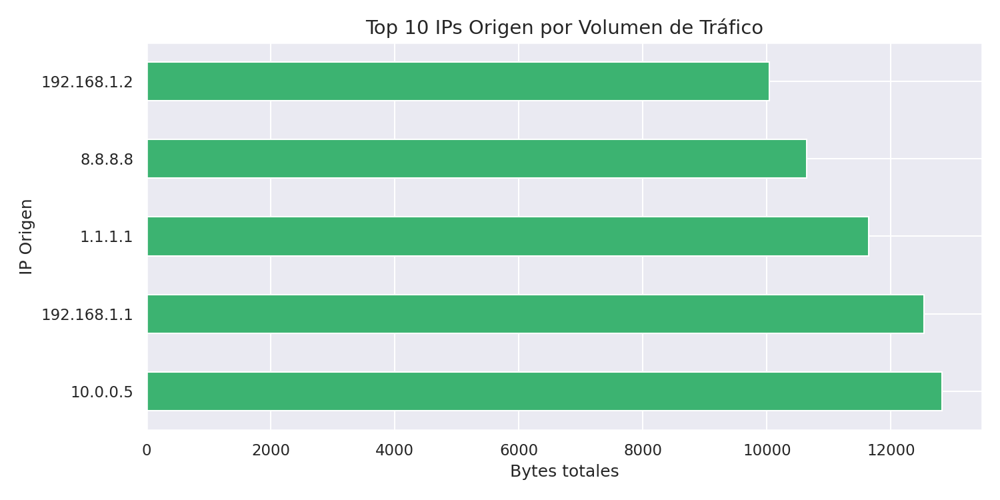
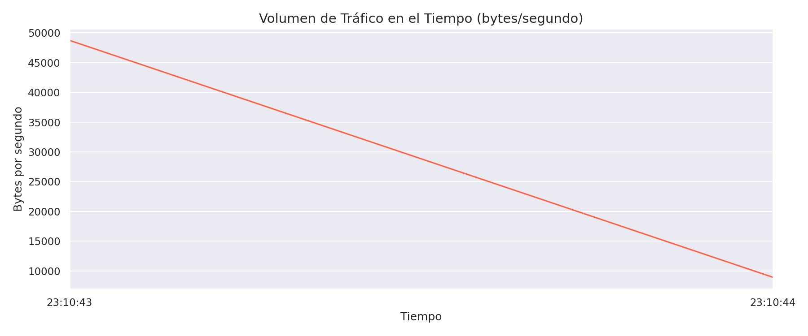

# net-traffic-analyzer
Network traffic analyzer using PyShark, Pandas &amp; Matplotlib
# NET-01: Network Traffic Analyzer

> Herramienta de análisis de tráfico de red usando PyShark, Pandas y Matplotlib.  
> Parte de mi portafolio profesional [Carlos Rodríguez](https://github.com/CarlosRolo) — Ingeniero en Telemática.


---

## Descripción

Analiza archivos `.pcap` capturados con Wireshark y genera reportes visuales automáticos:

- 📊 Distribución de protocolos (TCP, UDP, DNS, SSH, NTP...)
- 📈 Volumen de tráfico en el tiempo (bytes/segundo)
- 🌐 Top IPs origen por volumen de tráfico

##Estructura del Proyecto

net-traffic-analyzer/
├── src/
│   ├── capture.py       # Script principal (CLI)
│   ├── analyzer.py      # Lectura de .pcap con PyShark + Pandas
│   └── visualizer.py    # Gráficas con Matplotlib + Seaborn
├── data/samples/        # Archivos .pcap de muestra
├── reports/figures/     # Gráficas generadas (PNG)
├── tests/               # Unit tests
└── requirements.txt

##Instalación

```bash
# Clonar el repositorio
git clone https://github.com/CarlosRolo/net-traffic-analyzer.git
cd net-traffic-analyzer

# Crear entorno virtual
python3 -m venv venv
source venv/bin/activate

# Instalar dependencias
pip install -r requirements.txt

# Instalar TShark (requerido por PyShark)
sudo apt-get install -y tshark
```

## Uso

```bash
# Analizar un archivo .pcap
python3 src/capture.py data/samples/sample_http.pcap

# Sin guardar gráficas
python3 src/capture.py data/samples/sample_http.pcap --no-save
```

### Output esperado

[*] Analizando: data/samples/sample_http.pcap
[+] Total de paquetes : 200
[+] Total de bytes    : 57,682
[+] Tamaño promedio   : 288.41 bytes
[+] Protocolo top     : TCP
[+] IPs únicas        : 10
[✓] Análisis completado.

## Gráficas Generadas

| Protocolo | IPs Origen | Tráfico en el Tiempo |
|:---------:|:----------:|:--------------------:|
|  |  |  |

## tack Tecnológico

| Herramienta | Uso |
|---|---|
| PyShark 0.6 | Parsing de archivos .pcap |
| Pandas 3.0 | Análisis y manipulación de datos |
| Matplotlib + Seaborn | Visualización |
| Scapy | Generación de tráfico de prueba |
| TShark | Backend de captura (Wireshark CLI) |

##Autor

**Carlos David Rodríguez López**  
Ingeniero en Telemática — ESPOCH, Ecuador  
🔗 [github.com/CarlosRolo](https://github.com/CarlosRolo)

## Licencia

MIT License — ver [LICENSE](LICENSE)


